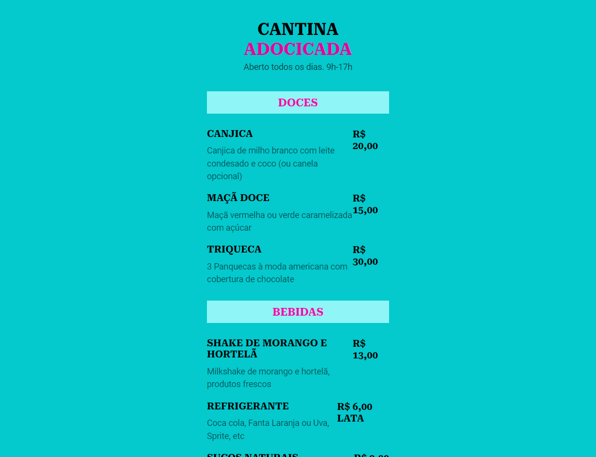

# MARATONA EXPLORER 3

Um projeto desenvolvido durante o evento
<b>Maratona Explorer</b> da Rocketseat.

[Clique aqui para acessar](file:///C:/Users/Aline/maratona%20rocket/index.html)

## <b>Meu aprendizado</b>

Através desse projeto aprendi como criar um modelo de cardápio e um QR code para meu portfólio.
Os principais acréscimos foram: 

- uso do HTML e CSS na prática
- como criar um QR code
- auxilio do Figma como ferramenta para escrever o css
- como guardar meu projeto no Github
- como acrescentar e editar atributos no css
- 

## <b>Tecnologias</b>

- HTML
- CSS
- GITHUB
- FIGMA

## <b>Meus contatos</b>

alinealbuquerqueprofi@gmail.com 
whatsapp (11) 95892-8769